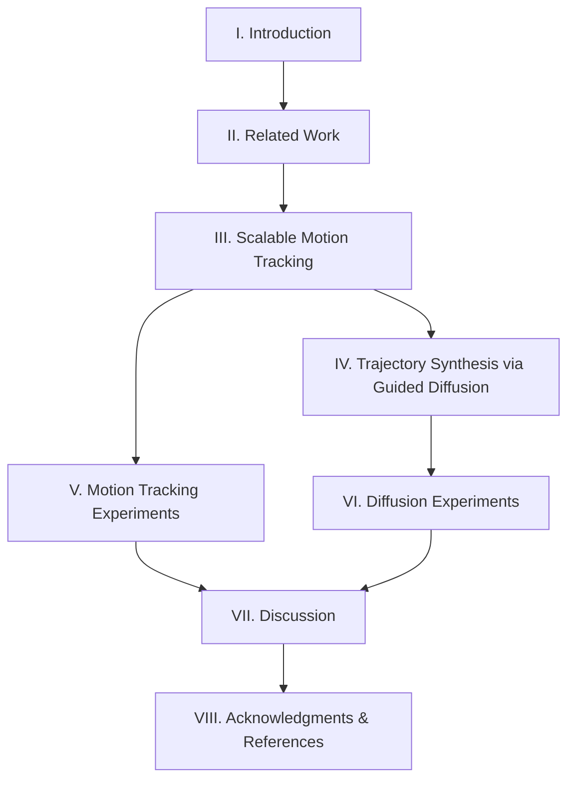

# BeyondMimic: Comprehensive Paper Analysis and Code Implementation Report

## Executive Summary

BeyondMimic is a two-stage framework for learning versatile humanoid control from human motions. This repository implements **only Stage 1** (motion tracking) of the paper, while Stage 2 (guided diffusion) is not included. The implementation provides a robust, scalable motion tracking pipeline capable of sim-to-real transfer for highly dynamic motions.

## Paper Structure Analysis

### 1. Paper Overview (8 Major Sections)

The paper is organized into the following sections with their relationships:



### 2. Core Components and Their Relationships

#### **Stage 1: Motion Tracking (Sections III & V)**
- **Purpose**: Transform kinematic references into robust, dynamic motions
- **Method**: Reinforcement Learning with PPO
- **Key Innovation**: Unified MDP with adaptive sampling
- **Output**: Trained tracking policies for individual motions

#### **Stage 2: Guided Diffusion (Sections IV & VI)**
- **Purpose**: Synthesize learned motions for flexible task control
- **Method**: State-action co-diffusion with classifier guidance
- **Key Innovation**: Test-time task specification via loss functions
- **Output**: Single unified policy for downstream tasks

### 3. Technical Details

#### 3.1 Motion Tracking Mathematics (Section III)

**Anchor Body Transformation (Lines 209-222):**
```math
T̂_b = T_Δ · T^(-1)_{banchor,m} · T_{b,m}
```
Where:
- `T_Δ = (p_Δ, R_Δ)` preserves height, aligns yaw, translates XY
- `p_Δ = [p_{banchor.x}, p_{banchor.y}, p_{banchor.z,m}]`
- `R_Δ = R_z(yaw(R_{banchor} · R^T_{banchor,m}))`

**DeepMimic Reward Function (Lines 334-342):**
```math
r_task = Σ_{χ∈{p,R,v,w}} exp(-ē_χ/σ²_χ)
```

**Adaptive Sampling Probability (Lines 388-397):**
```math
p_s = (Σ_{u=0}^{K-1} α^u · r̄_{s+u}) / (Σ_{j=1}^S Σ_{u=0}^{K-1} α^u · r̄_{j+u})
```

**Joint Impedance Control (Lines 276-282):**
```math
k_{p,j} = I_j · ω²_n
k_{d,j} = 2 · I_j · ζ · ω_n
```

#### 3.2 Guided Diffusion Mathematics (Section IV)

**DDPM Update Rule (Lines 455-465):**
```math
τ^{k-1}_t = α_k(τ^k_t - γ_k · ε_θ(τ^k_t, O_t, k) + N(0, σ²_k I))
```

**Classifier Guidance (Lines 471-489):**
```math
∇_τ log p(τ|τ*) = ∇_τ log p(τ) + ∇_τ log p(τ*|τ)
```

**Cost Functions:**
- **Joystick**: `G_js(τ) = 1/2 Σ||V_{xy,t'}(τ_t') - g_v||²`
- **Waypoint**: `G_wp(τ) = Σ[(1-e^{-2d})||P_x(s_t') - g_p||² + e^{-2d}||V_{x,t'}(τ_t')||²]`
- **Collision**: `G_sdf(τ) = ΣΣ B(SDF(P_{b,t'}(τ)) - r_i, δ)`

### 4. Experimental Results Summary

#### Motion Tracking Performance (Section V):
- **25 LAFAN1 sequences** tested (3+ minutes each)
- **29 challenging clips** deployed on hardware
- **4 motion categories** demonstrated:
  1. Previously demonstrated short dynamic motions
  2. Static balance-requiring motions
  3. Extremely dynamic novel motions (cartwheels, 360° spins)
  4. Stylized expressive motions (dancing, crawling)

#### Diffusion Performance (Section VI):
- **Walk-Perturb Task**: 100% success with Body-Pos representation
- **Joystick Control**: 80% success with Body-Pos representation
- **Key Finding**: Body-Pos state representation outperforms Joint-Rot

## Code Implementation Analysis

### What IS Implemented ✅

1. **Complete Motion Tracking Pipeline**
   - `MotionLoader`: NPZ motion file loading (`commands.py:30-59`)
   - `MotionCommand`: Reference motion management (`commands.py:61-299`)
   - Anchor body transformation (`commands.py:285-295`)
   - Adaptive sampling algorithm (`commands.py:207-242`)

2. **DeepMimic Reward System**
   - Position/orientation error rewards (`rewards.py:20-52`)
   - Velocity error rewards (`rewards.py:55-74`)
   - Exponential reward formulation matching paper

3. **Observation Space**
   - Policy observations with noise (`tracking_env_cfg.py:114-133`)
   - Asymmetric actor-critic with privileged info (`tracking_env_cfg.py:136-150`)

4. **Domain Randomization**
   - Physics material randomization (`tracking_env_cfg.py:158-168`)
   - Joint offset randomization (`tracking_env_cfg.py:170-178`)
   - CoM randomization (`tracking_env_cfg.py:180-187`)
   - Push perturbations (`tracking_env_cfg.py:190-195`)

5. **Training Infrastructure**
   - PPO training loop (`train.py`)
   - WandB integration for logging
   - ONNX export for deployment (`exporter.py`)

### What is NOT Implemented ❌

1. **Entire Diffusion Pipeline**
   - No DDPM implementation
   - No denoising networks
   - No transformer architecture
   - No state-action trajectory generation

2. **Guided Diffusion Components**
   - No classifier guidance
   - No cost function guidance
   - No test-time task specification
   - No trajectory synthesis

3. **Downstream Tasks**
   - No waypoint navigation
   - No joystick control interface
   - No obstacle avoidance with SDF
   - No multi-skill composition

4. **Diffusion Training Infrastructure**
   - No offline data collection from tracking policies
   - No trajectory dataset generation
   - No diffusion model training scripts
   - No inference pipeline

### Potential Issues and Gaps

1. **Incomplete Framework**
   - Repository only provides half of the BeyondMimic system
   - Cannot achieve the versatile control demonstrated in paper
   - Missing the key innovation of guided diffusion

2. **Deployment Limitations**
   - Current system can only replay individual motions
   - No ability to compose or transition between skills
   - No runtime task specification capability

3. **Missing Dependencies**
   - No diffusion libraries in requirements
   - No transformer/attention implementations
   - No trajectory optimization tools

4. **Documentation Gaps**
   - No mention of diffusion in CLAUDE.md
   - README focuses only on motion tracking
   - No guidance on implementing Stage 2

## Conclusions

### Repository Status
This repository implements a **high-quality, production-ready motion tracking system** that represents Stage 1 of the BeyondMimic framework. It successfully demonstrates:
- Scalable motion tracking with unified hyperparameters
- Robust sim-to-real transfer
- Adaptive sampling for efficient training
- Support for highly dynamic motions

### Missing Components
The guided diffusion system (Stage 2), which enables the framework's most innovative capabilities, is completely absent. This includes all components for:
- Learning unified multi-skill policies
- Test-time task specification
- Flexible trajectory synthesis
- Downstream task execution

### Recommendations

1. **For Motion Tracking**: The current implementation is complete and production-ready
2. **For Full BeyondMimic**: Additional implementation needed for diffusion components
3. **For Researchers**: Can use this as a strong baseline for motion tracking
4. **For Practitioners**: Suitable for single-motion deployment, not versatile control

### Key Takeaway
This repository provides an excellent implementation of scalable motion tracking but represents only 50% of the complete BeyondMimic system described in the paper. The guided diffusion component, which enables the system's most innovative features, would need to be implemented separately to achieve the full capabilities demonstrated in the research.